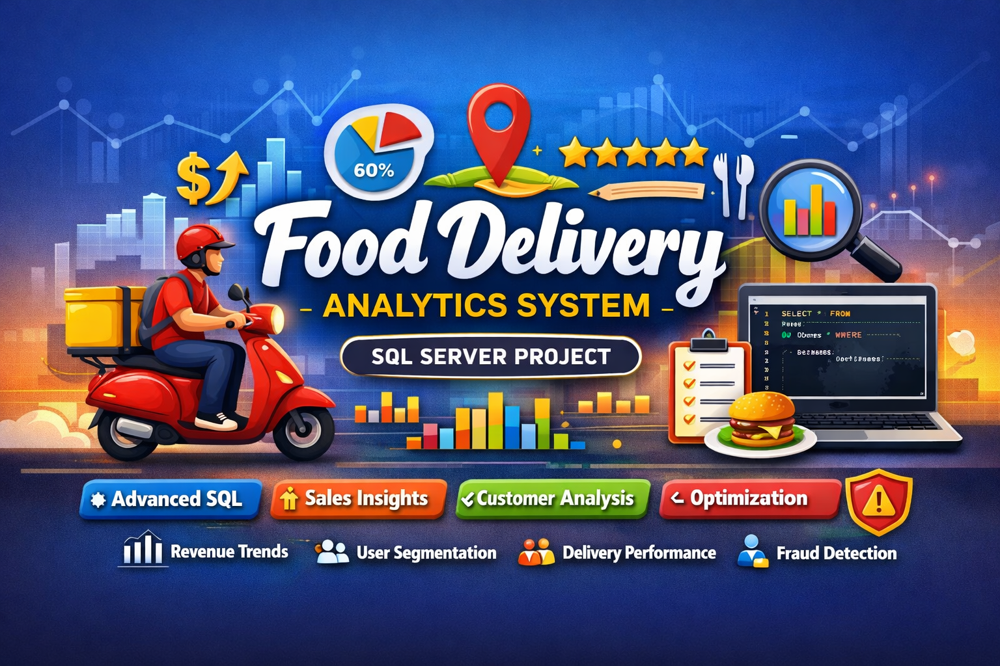

---
## 🍽️ Food Delivery System – Advanced SQL Project

## 📌 Project Overview

This project simulates a real-world **Food Delivery Platform (Zomato/Swiggy-style)** using Microsoft SQL Server. It is designed to demonstrate strong SQL expertise through **data modeling, advanced querying, performance optimization, and analytics use cases**.

The dataset contains realistic transactional data including customers, restaurants, orders, menu items, delivery partners, and reviews.

---

## 🎯 Objective

* Build a **production-like relational database system**
* Solve **real business problems using SQL**
* Demonstrate **advanced SQL skills for portfolio / freelancing (Upwork-ready)**

---

## 🗂️ Database Schema

The project consists of the following core tables:

* **Customers** – User details and demographics
* **Restaurants** – Restaurant information and location
* **Menu** – Food items offered by restaurants
* **Orders** – Transaction-level order data 
* **Order_Items** – Order line items (many-to-many relationship)
* **Delivery_Partners** – Delivery agent details
* **Reviews** – Customer feedback and ratings

---

## 🧠 SQL Concepts Covered

### 🔹 Basic to Intermediate

* SELECT, JOINs, GROUP BY
* Aggregations (SUM, AVG, COUNT)
* Filtering and sorting

### 🔹 Advanced SQL

* Window Functions (ROW_NUMBER, RANK, NTILE)
* CTEs (Common Table Expressions)
* Subqueries and correlated queries
* CASE statements and conditional logic

### 🔹 Expert Level

* Query optimization techniques
* Indexing strategies
* Stored procedures
* Dynamic SQL
* JSON handling (FOR JSON)
* Pivoting and reporting queries

---

## 💼 Portfolio Value

This project is ideal for:

* SQL Developer roles
* Data Analyst positions
* Freelancing platforms (Upwork/Fiverr)

It showcases **end-to-end SQL capabilities** from data modeling to advanced analytics.

---

## 🏁 Conclusion

This project provides a complete hands-on experience of working with a **real-world food delivery system dataset**, helping you build strong SQL expertise and industry-ready skills.

---
👨‍💻 Author

Ajit Kumar Giri
SQL Developer | Data Analyst | Power BI Enthusiast

---
⭐ If You Like This Project

Give it a ⭐ on GitHub and feel free to fork & use it!

